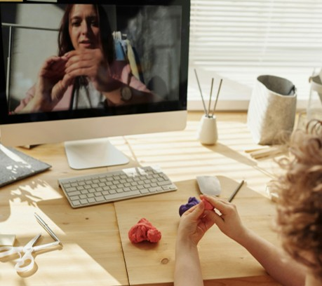
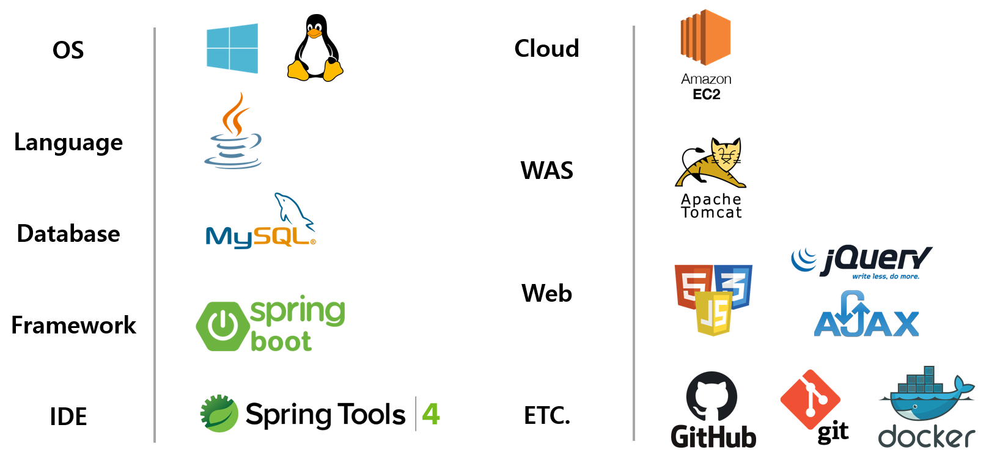
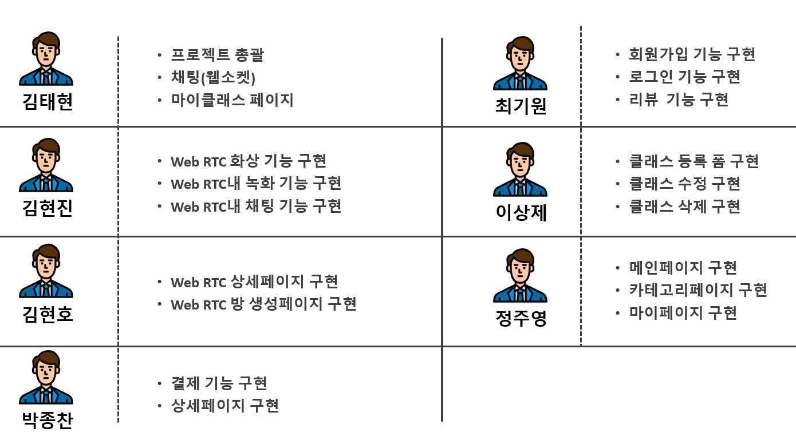
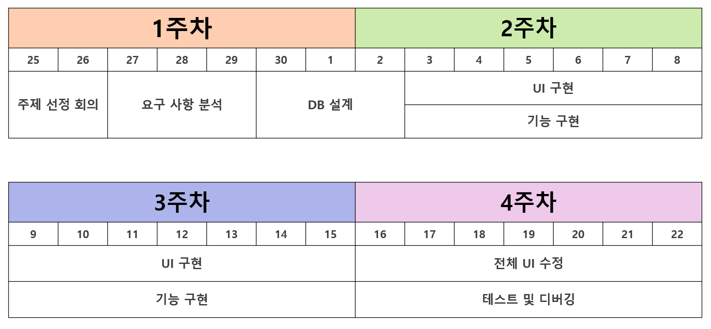
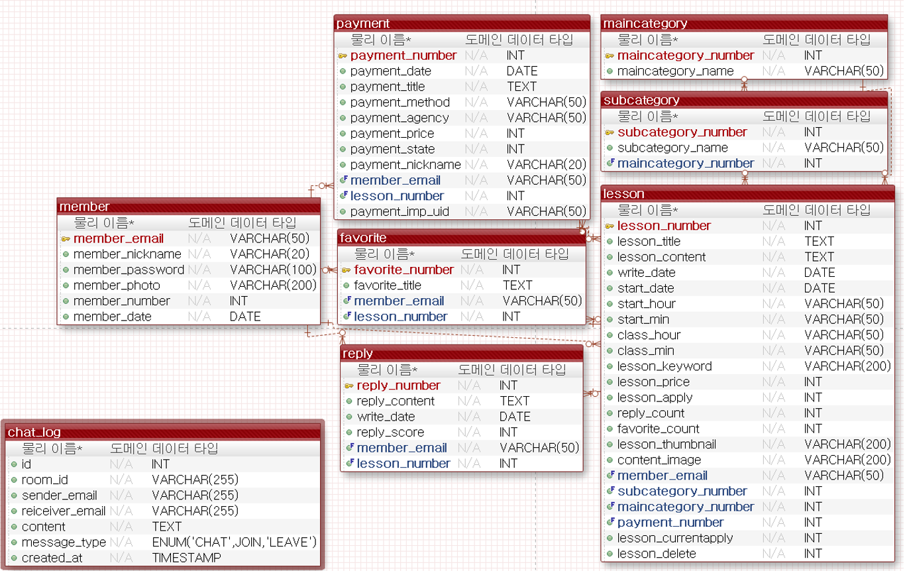
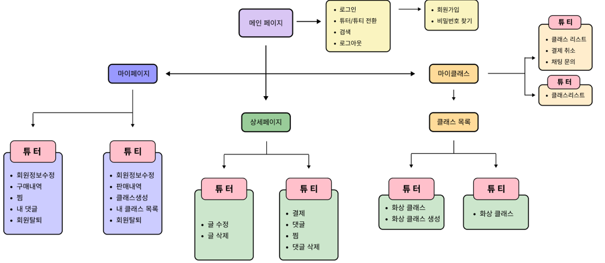

# secondProjec - 두번째 프로젝트 : 화상 공방
       

   2차 프로젝트는 팀 프로젝트로 학원에서 WebRTC라는 API를 활용해서 프로젝트를 진행할 것을 주문하였고 그에 따라 팀원들끼리 의견을 모아 생각한 프로젝트가 __화상 공방__ 입니다. 공예를 배우고 싶지만 시간이 없어 공방에 갈 수 없는 바쁜 현대인을 위해 화상으로 멘토와 함께 같이 공예를 만들어가는 화상 공방 사이트입니다. 학원에서 기업과 연계하여 프로젝트를 수행을 하였기 때문에 JSFlux라는 회사로부터 클라이언트의 기본적인 소스 부분을 받아 해당 소스를 분석, 재구성하여 WebRTC부분을 구현했습니다. 로그인, 게시판, 댓글, 결제, 클래스 등록, 리뷰 등 웹 사이트에 대한 기능은 다른 팀원들이 구현을 하였고 WebRTC부분의 소스 분석과 구현은 제가 했고 2개 페이지 디자인은 다른 팀원이 했습니다. 따라서 구현 부분 설명은 WebRTC부분만 설명 드리겠습니다.   

1. # 개발 환경
       

1. # 역할 분담
       

1. # 개발 일정
   전체 개발 기간은 1개월이였습니다.   
       

1. # ERD
       

1. # WorkFlow
          

1. # WebRTC란?
   