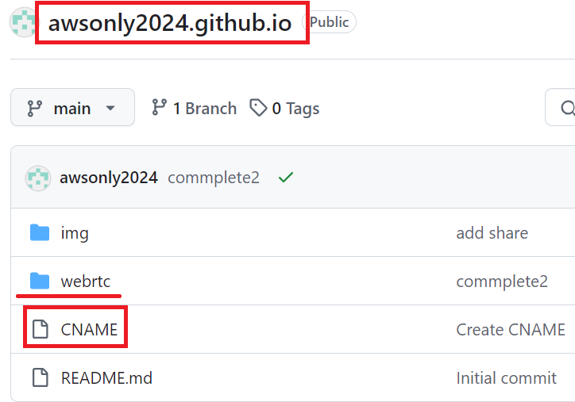
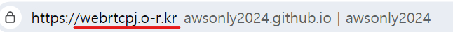
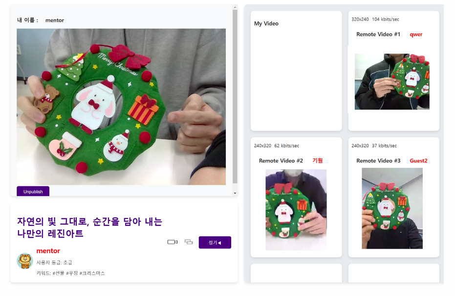
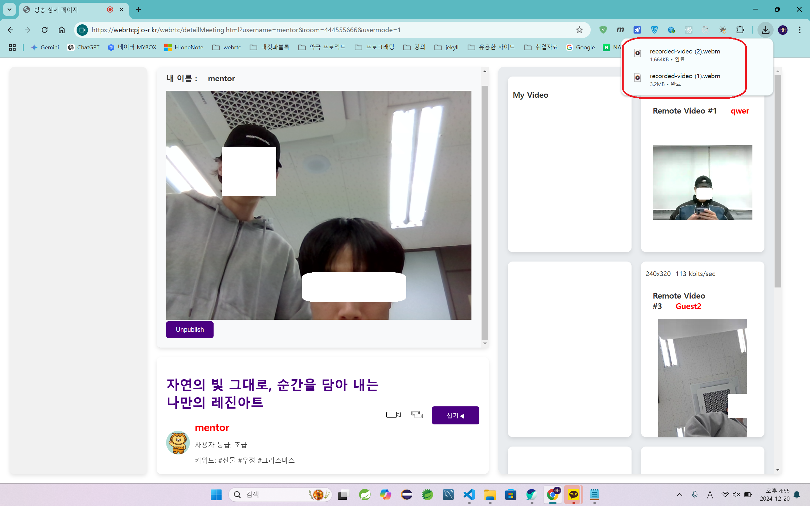
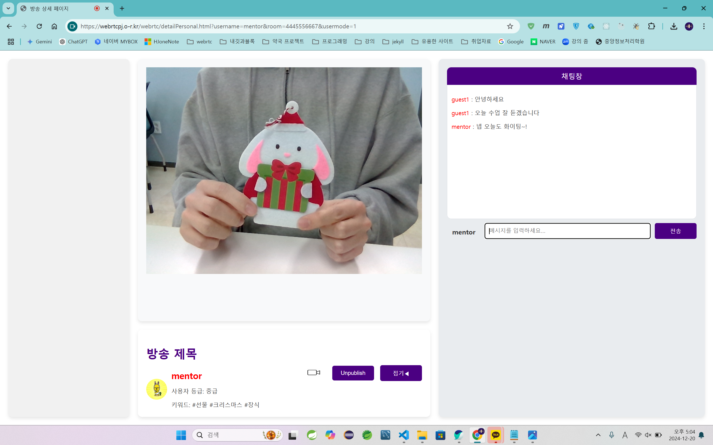

# secondProjec - 두번째 프로젝트 : 화상 공방
       

   2차 프로젝트는 팀 프로젝트로 학원에서 WebRTC라는 API를 활용해서 프로젝트를 진행할 것을 주문하였고 그에 따라 팀원들끼리 의견을 모아 생각한 프로젝트가 __화상 공방__ 입니다. 공예를 배우고 싶지만 시간이 없어 공방에 갈 수 없는 바쁜 현대인을 위해 화상으로 멘토와 함께 같이 공예를 만들어가는 화상 공방 사이트입니다. 기업과 연계하여 프로젝트를 수행을 하였기 때문에 JSFlux라는 회사로부터 클라이언트의 기본적인 소스 부분을 받아 해당 소스를 분석, 재구성하여 WebRTC부분을 구현했습니다. 로그인, 게시판, 댓글, 결제, 클래스 등록, 리뷰 등 웹 사이트에 대한 기능은 다른 팀원들이 구현을 하였고 WebRTC부분의 소스 분석과 구현은 저 혼자 했습니다. 따라서 구현 부분 설명은 WebRTC부분만 설명 드리겠습니다.   

   *demo 디렉토리는 챗팅을 하기 위한 자바 서버   
   *webrtcpj 디렉토리는 webrtc구현 부분

1. # 개발 환경
       

1. # 역할 분담
   전체 인원 : 6명   
   본인 : 김현지 - WebRTC 부분   
       

1. # 개발 일정
   개발 기간 : 1개월   
       

1. # 요구 분석

   __화상 클래스__   

   1.방 생성   
      Many To Many : 회의 모드로 멘토(가르치는 사람)와 멘티(배우는 사람) 모두 화면에 영상이 출력, 인원 제한 6명   
      One To Many : 유튜브나 아프리카TV와 같은 개인 방송 모드로 멘토(가르치는 사람)만 화면에 영상이 출력되고 멘티(배우는 사람)는 출력되지 않음, 인원 제한 없음

   2.기능   
      화면 공유 기능(멘토만 해당) : 멘토의 화면을 전체 멘티들과 공유   
      녹화(멘토만 해당) : 현재 수업하고 있는 자신의 화면을 녹화   
      채팅 : One To Many 모드에서 멘토와 멘티들의 의사소통 수단으로 사용용

1. # WebRTC란?
      

   <a href="https://developer.mozilla.org/ko/docs/Web/API/WebRTC_API">WebRTC MSDN</a>   
   WebRTC(Web Real-Time Communication)은 웹 애플리케이션과 사이트가 중간자 없이 브라우저 간에 오디오나 영상 미디어를 포착하고 마음대로 스트림할 뿐 아니라, 임의의 데이터도 교환할 수 있도록 하는 기술입니다. WebRTC를 구성하는 일련의 표준들은 플러그인이나 제 3자 소프트웨어 설치 없이 종단 간 데이터 공유와 화상 회의를 가능하게 합니다.   

   위에 글은 MSDN에 있는 WebRTC의 정의입니다. 중간자(특정 서버)없이 브라우저간(Peer-to-Peer) 스트림을 주고 받을 수 있는 강력한 멀티미디어 기능을 제공하는 API가 WebRTC입니다. 일단 통신이 이루어지면 서버는 필요가 없지만 초기 브라우저간 연결을 설정하기 위해서는 서버가 필수입니다. WebRTC구현을 위해서는 Signaling서버, STUN서버, TURN서버 3개의 서버가 필요합니다.   
   
   Signaling서버 - 초기 통신 단계   
   SDP 및 ICE 후보 교환   

   STURN서버 - 네트워크 경로 탐색   
   클라이언트 자신의 공인IP와 포트 번호 확인   

   TURN서버 - P2P연결실패(STURN 연결 실패)시 사용   
   P2P 연결이 실패하거나 매우 엄격한 NAT/방화벽 때문에 직접 연결이 불가능한 경우,  UDP/TCP를 이용한 NAT Traversal기법을 사용해 직접 P2P 연결을 시도   

   *서버는 연계된 기업에서 야누스 서버를 제공해 주었기 때문에 해당 서버를 사용했습니다.   

1. # Janus Server Architecture
   야누스 서버는 미디어를 담당하는 서버로 다자간 화상 회의 방식에서 미디어 스트림 중계를 담당합니다. 그리고 녹화 기능과 오디오 스트리밍을 제공합니다.

   __야누스 객체 생성__   
   ```javascript
      janus = new Janus(
		{
			server: server,
			success: function() {
         janus.attach(
         {
            plugin: "janus.plugin.videoroom",
            opaqueId: opaqueId,
            success: function(pluginHandle) {
            sfutest = pluginHandle;
            ...
            }
         })
         ...
         }
      })         
   ```   
   야누스 서버 객체를 생성하고 접속이 성공하면 핸들러를 받아옵니다.   

   __핸들러 안에 있는 콜백 함수들__   
   ```javascript
      iceState: function(state) { ... }
      mediaState: function(medium, on) { ... }
      webrtcState: function(on) { ... }
      onmessage: function(msg, jsep) { ... }
      onlocalstream: function(stream) { ... }
      onremotestream: function(stream) { ... }
      oncleanup: function() { ... }
   ```   
   위 콜백 함수들은 WebRTC 기반 미디어 스트림 통신에서 발생할 수 있는 상태와 이벤트를 처리하기 위해 사용됩니다.   
   iceState: ICE (Interactive Connectivity Establishment) 연결 상태를 모니터링   
   mediaState: 미디어 트랙(audio 또는 video)의 상태 확인   
   webrtcState: WebRTC 연결 상태를 모니터링    
   onmessage:  Janus 플러그인으로부터 메시지를 수신   
   onlocalstream: 로컬에서 생성된 미디어 스트림을 처리   
   onremotestream: 원격 피어로부터 수신된 미디어 스트림을 처리   
   oncleanup:  플러그인 인스턴스가 종료되거나 연결이 해제될 때 호출   

   __자신의 화면 공유__   
   ```javascript
      async function shareScreen(useAudio) {
         var originalStream = await navigator.mediaDevices.getUserMedia({ video: true });
         try{
            const screenStream = await navigator.mediaDevices.getDisplayMedia({
               video: true,
               audio: false,
            });
            sfutest.createOffer(
            {
               stream: screenStream,
               media: { audioRecv: false, videoRecv: false, audioSend: useAudio, videoSend: true },	
               simulcast: doSimulcast,
               simulcast2: doSimulcast2,
               success: function(jsep) {
                  Janus.debug("Got publisher SDP!", jsep);
                  var publish = { request: "configure", audio: useAudio, video: true };
                  
                  sfutest.send({ message: publish, jsep: jsep });
               },
               error: function(error) {
                ...
               }
            });
            screenStream.getTracks().forEach(track => {
            track.onended = () => {
               //공유 정지
               myvideo.srcObject = originalStream;
               window.location.reload();
            };
         });
      }}
   ```   
   Janus 서버의 SFU(Simple Forwarding Unit) 기능을 사용하여 sfutest.createOffer 스트림 생성   
   sfutest.send({ message: publish, jsep: jsep }) : 설정 메시지(publish)와 SDP(jsep)를 전송하여 미디어 스트림을 전송   

   __화상화면 설정__   
   ```javascript
      sfutest.createOffer({
			media: { audioRecv: false, videoRecv: false, audioSend: useAudio, videoSend: true },	 
			simulcast: doSimulcast,
			simulcast2: doSimulcast2,
			success: function(jsep) {
				var publish = { request: "configure", audio: useAudio, video: true };
				sfutest.send({ message: publish, jsep: jsep });
			},
      })
   ```   
   createOffer로 스트림 생성하고 audio와 video 설정   

1. #  Project Architecture
      

   최초 로딩이 되면 미디어를 담당하는 야누스 서버로 초기화됩니다. 이후 One To Many 방식에서 멘토와 멘티의 커뮤니케이션을 위해 채팅을 이용합니다. 채팅 서버는 스프링 부트로 만들어 EC2의 도커 이미지로 실행되고 있습니다.   

   1. ## Git Pages   
         

      다른 네트워크 영역의 컴퓨터와 휴대폰으로 접속하기 위해서 Git Pages웹호스팅을 사용했습니다. Git pages 주소가 서버 역할을 하게됩니다. 클라이언트들이 해당 주소로 접속을 하면 야누스 서버에서 이벤트가 발생할 때마다 콜백함수를 클라이언트로 돌려줍니다.   
         
      CNAME를 사용하여 도메인명을 변경하였습니다. awsonly2024.github.io가 원래 주소인데 해당 주소를 치면 webrtcpj.o-r.kr이란 도메인으로 접속이 됩니다.   

   1. ## Socket Chatting   
      자바 스프링 SockJS와 STOMP로 구현한 채팅 서버를 Docker 이미지로 만들어 EC2에 배포를 했습니다. EC2는 https만 접속을 허용하는데 자바 서버에는 https에 대한 처리가 되어있지 않았기 때문에 https로 request를 받은 경우 이를 처리하는 부분이 필요했습니다.   
      ```yml
         server.port=443
         server.ssl.enabled=true
         server.ssl.key-store=classpath:keystore.p12
         server.ssl.key-store-password=chatserverkey
         server.ssl.key-store-type=PKCS12
         server.ssl.key-alias=chatserverkey
      ```   
      SSL인증서로 키스토어를 생성합니다. keystore.p12. 해당 파일의 경로와 설정 옵션들을 application.properties에 기재합니다.   

1. # 시연
   1. ## 회의 모드   
      <table>
         <tr>
         <td></td>
         <td></td>
         </tr>
      </table>   

   1. ## 회의 모드 - 화면 공유   
      <table>
         <tr>
         <td></td>
         <td></td>
         </tr>
      </table>   

   1. ## 회의 모드 - 녹화   
      <table>
         <tr>
         <td></td>
         <td></td>
         </tr>
      </table>   
      
   1. ## 개인 방송 모드   
      <table>
         <tr>
         <td></td>
         <td></td>
         </tr>
      </table>   
   
